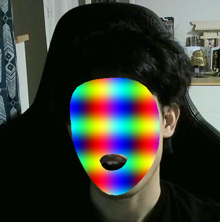

Face filter on web.

This project is using pre-trained ML model provided by Google.
https://www.npmjs.com/package/@tensorflow-models/face-landmarks-detection
https://developers-jp.googleblog.com/2020/04/mediapipe-tensorflowjs.html

References
Thanks to the code / article writers. I refered the articles.

https://github.com/spite/FaceMeshFaceGeometry
https://heartbeat.fritz.ai/getting-started-with-face-landmark-detection-with-tensorflow-js-9f4ae03f86ee
https://threejsfundamentals.org/threejs/lessons/threejs-shadertoy.html